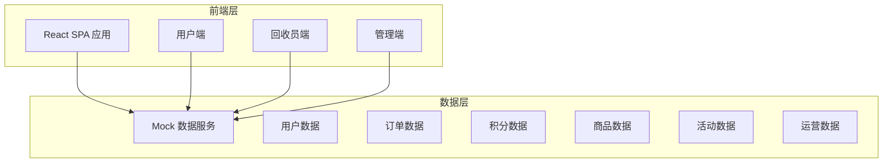
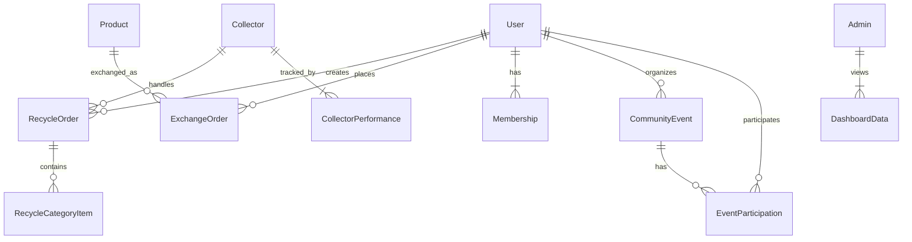

## 1. 架构设计



## 2. 技术说明

- 前端：React@18 + TailwindCSS@3 + Vite
- 初始化工具：Vite
- 后端：无（纯前端 Mock 数据）
- 数据库：无（使用 Mock 数据模拟）
- 状态管理：React Context + useReducer
- 图表库：Recharts
- 图标库：Lucide React
- 路由：React Router v6

## 3. 路由定义

| 路由 | 用途 |
|------|------|
| / | 首页 - 品类入口、快捷预约、积分概览、活动推荐 |
| /recycle/book | 预约回收 - 品类选择、地址填写、时间预约 |
| /recycle/order/:id | 订单详情 - 回收全流程跟踪 |
| /recycle/orders | 我的订单 - 订单列表 |
| /collector/dashboard | 回收员工作台 - 待接订单、绩效面板 |
| /collector/order/:id | 回收员订单处理 - 扫码、称重、拍照 |
| /mall | 积分商城 - 商品分类浏览 |
| /mall/product/:id | 商品详情 - 兑换操作 |
| /mall/orders | 兑换记录 - 物流跟踪 |
| /community | 社区活动 - 活动列表 |
| /community/create | 发起活动 - 活动创建表单 |
| /community/event/:id | 活动详情 - 签到、统计 |
| /membership | 会员中心 - 等级、权益、进度 |
| /admin | 管理看板 - 数据总览 |
| /admin/reports | 运营报表 - 导出功能 |
| /admin/predictions | 预测建议 - 智能推荐 |

## 4. API 定义（Mock 数据）

### 4.1 用户相关

```typescript
interface User {
  id: string;
  name: string;
  phone: string;
  avatar: string;
  points: number;
  memberLevel: "normal" | "silver" | "gold" | "diamond";
  totalRecycledWeight: number;
  activity: number;
  addresses: Address[];
}

interface Address {
  id: string;
  label: string;
  detail: string;
  lat: number;
  lng: number;
  isDefault: boolean;
}
```

### 4.2 订单相关

```typescript
interface RecycleOrder {
  id: string;
  userId: string;
  collectorId: string | null;
  categories: RecycleCategory[];
  estimatedWeight: number;
  actualWeight: number | null;
  address: Address;
  scheduledTime: string;
  status: "pending" | "matched" | "accepted" | "arrived" | "weighing" | "completed" | "cancelled";
  pointsEarned: number | null;
  photos: string[];
  collectorRating: number | null;
  createdAt: string;
  completedAt: string | null;
}

type RecycleCategory = "paper" | "plastic" | "metal" | "electronics" | "clothes";
```

### 4.3 积分商品

```typescript
interface Product {
  id: string;
  name: string;
  description: string;
  image: string;
  pointsPrice: number;
  stock: number;
  category: string;
}

interface ExchangeOrder {
  id: string;
  userId: string;
  productId: string;
  pointsCost: number;
  status: "pending" | "shipped" | "delivered";
  trackingNumber: string | null;
  createdAt: string;
}
```

### 4.4 社区活动

```typescript
interface CommunityEvent {
  id: string;
  title: string;
  description: string;
  type: RecycleCategory | "mixed";
  location: string;
  lat: number;
  lng: number;
  startTime: string;
  endTime: string;
  organizerId: string;
  volunteers: string[];
  maxParticipants: number;
  currentParticipants: number;
  checkInPoints: number;
  status: "upcoming" | "ongoing" | "completed";
}
```

### 4.5 回收员

```typescript
interface Collector {
  id: string;
  name: string;
  phone: string;
  avatar: string;
  rating: number;
  totalOrders: number;
  monthlyOrders: number;
  monthlyEarnings: number;
  status: "online" | "offline" | "busy";
  location: { lat: number; lng: number };
}
```

### 4.6 运营数据

```typescript
interface DashboardData {
  totalRecycledWeight: number;
  totalOrders: number;
  activeCollectors: number;
  pointsExchangeRate: number;
  complaintResolutionTime: number;
  categoryBreakdown: { category: string; weight: number; orders: number }[];
  monthlyTrend: { month: string; weight: number; orders: number; points: number }[];
  collectorPerformance: { id: string; name: string; orders: number; rating: number; earnings: number }[];
  prediction: { nextMonthPeak: string; suggestedPriceAdjustment: Record<string, number>; suggestedStaffCount: number };
}
```

## 5. 服务器架构图

无后端，纯前端 Mock 数据架构。

## 6. 数据模型

### 6.1 数据模型定义



### 6.2 数据定义语言

使用 TypeScript 接口定义代替 DDL，所有数据以 Mock JSON 形式存储在前端 src/data/ 目录下。
